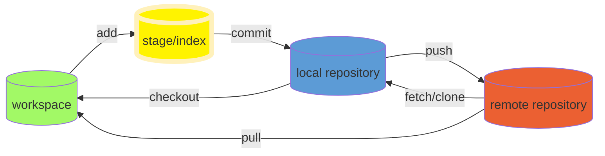

---
date:
  created: 2023-10-31
---

# Learning Git

## 基本概念



### 创建仓库

| 命令              | 说明           |
| :---------------- | :------------- |
| `git init`        | 初始化仓库     |
| `git clone <url>` | 克隆远程版本库 |

### 提交与修改

| 命令         | 说明                                     |
| :----------- | :--------------------------------------- |
| `git add`    | 添加文件到暂存区                         |
| `git status` | 查看仓库当前的状态，显示有变更的文件。   |
| `git diff`   | 比较文件的不同，即暂存区和工作区的差异。 |
| `git commit` | 提交暂存区到本地仓库。                   |
| `git reset`  | 回退版本。                               |
| `git rm`     | 将文件从暂存区和工作区中删除。           |
| `git mv`     | 移动或重命名工作区文件。                 |

### 提交日志

| 命令               | 说明                                 |
| :----------------- | :----------------------------------- |
| `git log`          | 查看历史提交记录                     |
| `git blame <file>` | 以列表形式查看指定文件的历史修改记录 |

### 远程操作

| 命令         | 说明               |
| :----------- | :----------------- |
| `git remote` | 远程仓库操作       |
| `git fetch`  | 从远程获取代码库   |
| `git pull`   | 下载远程代码并合并 |
| `git push`   | 上传远程代码并合并 |

1. `rm <file>` 可以在任何文件夹都可以用，包括不是 git 仓库的地方，是用来删除文件。如果用在 git 仓库里，则可以视为**删除工作区的文件**。

2. `git rm <file>` 只能在 git 仓库里使用，是用来删除 **[工作区+暂存区]** 的文件用的。如果在 git 仓库外使用就会报错。

3. `git rm --cached <file>` 如果想**仅删除暂存区**里的文件可以用此命令，它不会删除工作区中的文件。

4. 如果想删除 HEAD 仓库里的文件，好像没有专门的命令，只能 commit 作 log。具体操作是：rm→add→commit 或 git rm→commit。

!!! tip

    如果想知道 HEAD 指向，可以通过 `cat .git/HEAD` 查看；若 HEAD 指向的是一个引用，还可以用 `git symbolic-ref HEAD` 查看。

    - `HEAD~` 后面加数字表示后退的步数，每次后退都默认退到第一个父提交上，`HEAD~2` 表示连退两步。
    - `HEAD^` 后面加数字表示只退一步，但是这一步后退到数字表示的父提交上，`HEAD^2` 表示退一步到第二个父提交上。

```git
git init                                                  # 初始化本地git仓库（创建新仓库）
git config --global user.name "xxx"                       # 配置用户名
git config --global user.email "xxx@xxx.com"              # 配置邮件
git config --global color.ui true                         # git status等命令自动着色
git config --global color.status auto
git config --global color.diff auto
git config --global color.branch auto
git config --global color.interactive auto
git config --global --unset http.proxy                    # remove  proxy configuration on git
git clone git+ssh://git@192.168.53.168/VT.git             # clone远程仓库
git status                                                # 查看当前版本状态（是否修改）
git add xyz                                               # 添加xyz文件至index
git add .                                                 # 增加当前子目录下所有更改过的文件至index
git commit -m 'xxx'                                       # 提交
git commit --amend -m 'xxx'                               # 合并上一次提交（用于反复修改）
git commit -am 'xxx'                                      # 将add和commit合为一步
git rm xxx                                                # 删除index中的文件
git rm -r *                                               # 递归删除
git log                                                   # 显示提交日志
git log -2                                                # 显示2行日志 -n为n行
git log --stat                                            # 显示提交日志及相关变动文件
git log -p -m
git show dfb02e6e4f2f7b573337763e5c0013802e392818         # 显示某个提交的详细内容
git show dfb02                                            # 可只用commitid的前几位
git show HEAD                                             # 显示HEAD提交日志
git tag                                                   # 显示已存在的tag
git tag -a v2.0 -m 'xxx'                                  # 增加v2.0的tag
git show v2.0                                             # 显示v2.0的日志及详细内容
git log v2.0                                              # 显示v2.0的日志
git diff                                                  # 显示所有未添加至index的变更
git diff --cached                                         # 显示所有已添加index但还未commit的变更
git diff HEAD^                                            # 比较与上一个版本的差异
git diff HEAD -- ./lib                                    # 比较与HEAD版本lib目录的差异
git diff origin/master..master                            # 比较远程分支master上有本地分支master上没有的
git diff origin/master..master --stat                     # 只显示差异的文件，不显示具体内容
git remote add origin git+ssh://git@192.168.53.168/VT.git # 增加远程定义（用于push/pull/fetch）
git branch                                                # 显示本地分支
git branch --contains 50089                               # 显示包含提交50089的分支
git branch -a                                             # 显示所有分支
git branch -f master HEAD^                                # 将分支master强制移动到HEAD父节点
git branch -r                                             # 显示所有原创分支
git branch --merged                                       # 显示所有已合并到当前分支的分支
git branch --no-merged                                    # 显示所有未合并到当前分支的分支
git branch -m master master_copy                          # 本地分支改名
git branch -d hotfixes/BJVEP933                           # 删除分支hotfixes/BJVEP933（本分支修改已合并到其他分支）
git branch -D hotfixes/BJVEP933                           # 强制删除分支hotfixes/BJVEP933
git checkout -b master_copy                               # 从当前分支创建新分支master_copy并检出
git checkout -b master master_copy                        # 上面的完整版
git checkout features/performance                         # 检出已存在的features/performance分支
git checkout --track hotfixes/BJVEP933                    # 检出远程分支hotfixes/BJVEP933并创建本地跟踪分支
git checkout v2.0                                         # 检出版本v2.0
git checkout -b devel origin/develop                      # 从远程分支develop创建新本地分支devel并检出
git checkout -- README                                    # 检出head版本的README文件（可用于修改错误回退）
git merge origin/master                                   # 合并远程master分支至当前分支
git cherry-pick ff44785404a8e                             # 合并提交ff44785404a8e的修改
git push origin master                                    # 将当前分支push到远程master分支
git push origin :hotfixes/BJVEP933                        # 删除远程仓库的hotfixes/BJVEP933分支
git push --tags                                           # 把所有tag推送到远程仓库
git fetch                                                 # 获取所有远程分支（不更新本地分支，另需merge）
git fetch --prune                                         # 获取所有原创分支并清除服务器上已删掉的分支
git pull origin master                                    # 获取远程分支master并merge到当前分支
git mv README README2                                     # 重命名文件README为README2
git reset --hard HEAD                                     # 将当前版本重置为HEAD（通常用于merge失败回退）
git rebase
git ls-files                                              # 列出git index包含的文件
git show-branch                                           # 图示当前分支历史
git show-branch --all                                     # 图示所有分支历史
git whatchanged                                           # 显示提交历史对应的文件修改
git revert dfb02e6e4f2f7b573337763e5c0013802e392818       # 撤销提交dfb02e6e4f2f7b573337763e5c0013802e392818
git ls-tree HEAD                                          # 内部命令：显示某个git对象
git rev-parse v2.0                                        # 内部命令：显示某个ref对于的SHA1 HASH
git reflog                                                # 显示所有提交，包括孤立节点
git show HEAD@{5}
git show master@{yesterday}                               # 显示master分支昨天的状态
git log --pretty=format:'%h %s' --graph                   # 图示提交日志
git show -s --pretty=raw 2be7fcb476
git stash                                                 # 暂存当前修改，将所有至为HEAD状态
git stash list                                            # 查看所有暂存
git stash show -p stash@{0}                               # 参考第一次暂存
git stash apply stash@{0}                                 # 应用第一次暂存
git grep "delete from"                                    # 文件中搜索文本“delete from”
git grep -e '#define' --and -e SORT_DIRENT
git gc
git fsck
```

---

作者：[悟透](https://www.cnblogs.com/wutou/)
原文链接：<https://www.cnblogs.com/wutou/p/17585668.html>

## credential.helper 账密操作

### 说明

Git 使用简单的 `.ini` 文件作为配置文件，配置文件中记录了很多 Git 命令使用的各种选项和设置，Git 支持不同级别的配置文件，下面按照优先级从高到低的顺序对它们进行介绍：

> `.git/config` 当前版本库特定的配置文件，可使用 --file 选项修改，是 Git 的默认选项，此文件具有最高优先级。
> `~/.gitconfig` 当前用户的配置文件，可使用 --global 选项修改。
> `/etc/gitconfig` 系统级别的配置文件，可使用 --system 选项修改，此文件中的设置优先级最低。（Windows 的 etc 路径在你安装 git 目录下，默认 `C:\Program Files\Git\etc\gitconfig`）

注意：不要将配置文件路径设置到项目文件夹里，会泄露账号密码  
注意：不要将配置文件路径设置到项目文件夹里，会泄露账号密码  
注意：不要将配置文件路径设置到项目文件夹里，会泄露账号密码

### 一、系统级

整台电脑上的所有用户都有效：（不推荐）  
配置项写入到 "C:\Program Files\Git\etc\gitconfig" 文件中。

#### 1.设置记录账户密码，模式为 store

```bash
git config --system credential.helper store
```

#### 2.取消(删除)记录账号和密码

```bash
git config --system --unset credential.helper
```

#### 3.查询 凭证存储模式

```bash
git config --system credential.helper或git config --system --list或git config --system -l
```

#### 4.修改 配置文件

```bash
git config --file="C:\Program Files\Git\etc\gitconfig" --system credential.helper "store"或git config --system  user.name "store"
```

以上命令，不推荐使用：

> 1.需要在 git bash 上右键--"以管理员身份运行" 或 需要给 `C:\Program Files\Git\`下 etc 文件夹，everyone 完全控制权限，才能执行成功。  
> 2.如果没有权限会提示 “error: could not lock config file C:/Program Files/Git/etc/gitconfig: Permission denied”

### 二、用户级

当前用户下，所有项目有效：  
配置项写入到 `C:\Users\用户名\.gitconfig` 文件中。

#### 1.设置账号密码当前登录用户，全局项目 git 仓库有效

```bash
git config --global credential.helper store或git config --global credential.helper manager
```

#### 2.取消(删除)记录账号和密码

```bash
git config --global --unset credential.helper
```

#### 3.查询 凭证存储模式

```bash
git config --global credential.helper或git config --global --list或git config --global -l
```

#### 4.修改 配置文件

```bash
git config --file=~/.git_credentails --global credential.helper "store"或git config --global  user.name "store"
```

### 三、项目级

只在当前项仓库下有效，在有 .git 文件夹下执行：  
配置项写入到项目的 ".git/config" 文件中。

#### 1.设置账号密码当前项目 git 仓库有效

```bash
git config credential.helper store
```

> 如果没有--global，则在当前项目下的.git/config 文件中添加。

#### 2.取消(删除)记录账号和密码

```bash
git config --unset credential.helper
```

#### 3.查询 凭证存储模式

```bash
git config credential.helper或git config --list或git config -l
```

> 如果当前项目下没有设置，则显示 --global 的模式

#### 4.修改 配置文件

```bash
git config --file=.git/config credential.helper "store"或git config user.name "store"
```

### 四、临时记住密码

1）默认记住 15 分钟：

```bash
git config --global credential.helper cache
```

2）记住 1 小时：

```bash
git config --global credential.helper 'cache --timeout=3600'
```

### 五、其他

#### 1.可选凭证存储模式

https://zhuanlan.zhihu.com/p/157751660

- **"cache" 模式**  
   会将凭证存放在内存中一段时间。 密码永远不会被存储在磁盘中，并且在 15 分钟后从内存中清除。
- **"store" 模式**  
   会将凭证用明文的形式存放在磁盘中，并且永不过期。  
   这意味着除非你修改了你在 Git 服务器上的密码，否则你永远不需要再次输入你的凭证信息。  
   这种方式的缺点是你的密码是用明文的方式存放在你的 home 目录下。
- **"osxkeychain" 模式**  
   如果你使用的是 Mac，Git 还有一种 “osxkeychain” 模式，它会将凭证缓存到你系统用户的钥匙串中。  
   这种方式将凭证存放在磁盘中，并且永不过期，但是是被加密的，这种加密方式与存放 HTTPS 凭证以及 Safari 的自动填写是相同的。
- **"manager" 模式**  
   如果你使用的是 Windows，你可以安装一个叫做 “Git Credential Manager for Windows” 的辅助工具。  
   这和上面说的 “osxkeychain” 十分类似，但是是使用 Windows Credential Store 来控制敏感信息。

#### 2.如果是 manager 模式

https://www.jianshu.com/p/8d8fb86e415a

> 使用命令后，凭据会被记录到系统的凭据管理里。  
> 位置: 控制面板--用户账户--凭据管理--windows 凭据，查看和删除。

#### 3.命令行添加到管理凭据

1）删除某个存储在 “windows 凭据” 的账号密码

```bash
cmdkey /delete:git:https://gitee.com
```

2）添加某个存储在 "windows 凭据" 的账号密码

```bash
cmdkey /generic:git:http://gitee.com /user:%username% /password:%password%
```

> 1.或者可以在 “windows 凭据” 管理界面，点击 “添加普通凭证”  
> 2.%username% 和 %password% 代表当前登录 Windows 用户的账号密码  
> 3.提示“找不到元素”，可能是凭据名称输入错误

> 添加后，凭据管理界面，返回 或 重新点击“windows 凭据” 刷新显示，新的凭据
